# Air-Quality-Project

##### by Justin Wright

## Project objective

##### Evaluate the reliability of low-cost air quality sensors by validating PurpleAir PM2.5 measurements against EPA AirNow reference monitors, using dual-channel (A/B) consistency and humidity conditions to distinguish true pollution exposure from measurement bias.

## How this project came to be

##### At the onset of this project, I sought to find a dataset having to do with air quality readings so that I could take a look at the correlation between hazardous air conditions and reported asthma attacks. It was in this search that I stumbled upon PurpleAir and decided to use their sensors to satisfy the former. Although, in this process, through concerned users of their own sensors and by the admittance of the company in their own forums, I became aware of the possibility of sensors to underestimate and overestimate particulate matter readings depending on environmental factors and ware of the device. The company is aware of this case, allowing consumers to look at different conversion factors of their readings based on what meets their needs best. So while PurpleAir does not seem to oversell the efficacy of their product to consumers, with the main selling points being the sensors small size and greater affordability compared to its competitors, I was convinced to change the course of action for this project and investigate.

## Staging table cleaning and column creation

_cleaning_purpleair.sql, cleaning_airnow.sql, insertion.sql_

#### Goal: Transform and remove "bad" data from each dataset to leave us with data we can appropriately compare to each other, while also recording what proportion of the data we ingested was faulty or reported

#### Part 1: PurpleAir

After some basic initial queries checking for NULLs and pattern matching with regex, I performed a join to verify all indexes have a match between tables, where I was suprised to find an excessive number of indexes do not

```
SELECT d.sensor_index, COUNT(*) AS row_ct
FROM staging_purpleair_sensor_data d
LEFT JOIN staging_purpleair_sensors s
ON s.sensor_index = d.sensor_index
WHERE s.sensor_index IS NULL
GROUP BY d.sensor_index;
```

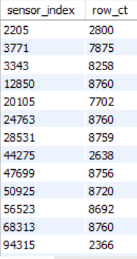  
I examined two indexes that should have matched and realized the indexes in the history dataset has a return carriage '0d' appended at the end of the values, so I altered my LOAD DATA query to replace these characters in the insert script

```
(time_stamp, humidity, temperature, `pm2.5_atm_a`, `pm2.5_atm_b`, `pm2.5_cf_1_a`,
`pm2.5_cf_1_b`, @sensor_index)
SET sensor_index = REPLACE(TRIM(@sensor_index), '\r', '')
```

Following this I decided to reun a check on the opposite as well

```
SELECT s.sensor_index
FROM staging_purpleair_sensors s
LEFT JOIN staging_purpleair_sensor_data d
ON d.sensor_index = s.sensor_index
WHERE d.sensor_index IS NULL;
```

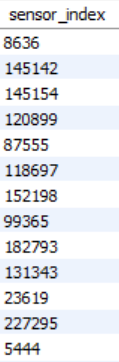  
This revealed 122 sensors that do not appear in the PurpleAir history dataset, so they could be promptly disposed of

```
DELETE FROM staging_purpleair_sensors
WHERE sensor_index IN (
  SELECT sensor_index
  FROM (
    SELECT s.sensor_index
    FROM staging_purpleair_sensors s
    LEFT JOIN staging_purpleair_sensor_data d
      ON d.sensor_index = s.sensor_index
    WHERE d.sensor_index IS NULL
  ) x
);
```

Running the following snippet revealed empty or NULL values wuthin the purpleair sensor data table

```SELECT
SUM(time_stamp IS NULL OR TRIM(time_stamp) = '') AS time_stamp_nulls,
SUM(humidity IS NULL OR TRIM(humidity) = '') AS humidity_nulls,
SUM(temperature IS NULL OR TRIM(temperature) = '') AS temperature_nulls,
SUM(`pm2.5_atm_a` IS NULL OR TRIM(`pm2.5_atm_a`) = '') AS pm25_atm_a_nulls,
SUM(`pm2.5_atm_b` IS NULL OR TRIM(`pm2.5_atm_b`) = '') AS pm25_atm_b_nulls,
SUM(`pm2.5_cf_1_a` IS NULL OR TRIM(`pm2.5_cf_1_a`) = '') AS pm25_cf_1_a_nulls,
SUM(`pm2.5_cf_1_b` IS NULL OR TRIM(`pm2.5_cf_1_b`) = '') AS pm25_cf_1_b_nulls
FROM staging_purpleair_sensor_data;
```

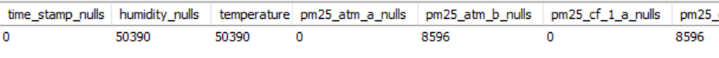
The first thing I wanted to look at was finding out what proportion of an indexes humidity and temperature values are not
appearing

```
SELECT
  sensor_index,
  humidity_empty_ct,
  humidity_ct,
  ROUND(100*humidity_empty_ct/NULLIF(humidity_ct, 0),1) AS humidity_empty_pct,
  temperature_empty_ct,
  temperature_ct,
  ROUND(100*temperature_empty_ct/NULLIF(temperature_ct, 0),1) AS temperature_empty_pct
FROM (
	SELECT sensor_index,
    SUM(humidity = '' OR humidity IS NULL) AS humidity_empty_ct,
    COUNT(humidity) AS humidity_ct,
    SUM(temperature = '' OR humidity IS NULL) AS temperature_empty_ct,
    COUNT(temperature) AS temperature_ct
	FROM staging_purpleair_sensor_data
	GROUP BY sensor_index
) s
WHERE humidity_empty_ct > 0 OR temperature_empty_ct > 0
ORDER BY humidity_empty_pct DESC, temperature_empty_pct DESC;
```

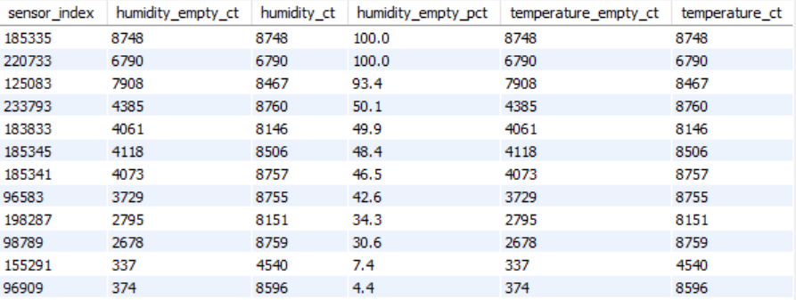  
Further analysis revealed that all these rows have values of '' for both humidity and temperature

A total of 50,390 rows contained these missing values and it was decided that these should be dropped in the case that these specific devices are faulty, especially given that for these devices, bad humidity and temperature rows make up such a large portion of the data they provide

The sensors were removed from both PurpleAir data sets

```
DELETE FROM staging_purpleair_sensor_data
WHERE humidity = '' OR humidity IS NULL OR temperature = '' OR temperature IS NULL;
```

```
DELETE FROM staging_purpleair_sensors
WHERE sensor_index NOT IN (
	SELECT DISTINCT sensor_index FROM staging_purpleair_sensor_data
);
```

Next up was looking at the atm_b and cf_1_b rows that we're NULL or empty

```
SELECT sensor_index,
SUM(`pm2.5_atm_b` IS NULL OR TRIM(`pm2.5_atm_b`) = '') AS pm25_atm_b_bad_rows,
SUM(`pm2.5_cf_1_b` IS NULL OR TRIM(`pm2.5_cf_1_b`) = '') AS pm25_cf_1_b_bad_rows,
COUNT(*) AS total_rows
FROM staging_purpleair_sensor_data 
GROUP BY sensor_index
HAVING pm25_atm_b_bad_rows > 0 OR pm25_cf_1_b_bad_rows > 0;
```

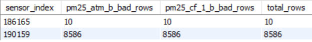  

Seeing that there are only two sensors that are returned on this query, with 100% of all the row contributions from those sensors having missing data (10 and 7655), it is better to assume those sensors are faulty and all cooresponding data can be deleted from each dataset

```
DELETE FROM staging_purpleair_sensors
WHERE sensor_index IN (
  SELECT sensor_index
  FROM (
    SELECT DISTINCT sensor_index
    FROM staging_purpleair_sensor_data
    WHERE (`pm2.5_atm_b` IS NULL OR TRIM(`pm2.5_atm_b`) = '')
       OR (`pm2.5_cf_1_b` IS NULL OR TRIM(`pm2.5_cf_1_b`) = '')
  ) s
);
```
```
DELETE FROM staging_purpleair_sensor_data
WHERE sensor_index IN (
  SELECT sensor_index
  FROM (
    SELECT DISTINCT sensor_index
    FROM staging_purpleair_sensor_data
    WHERE (`pm2.5_atm_b` IS NULL OR TRIM(`pm2.5_atm_b`) = '')
       OR (`pm2.5_cf_1_b` IS NULL OR TRIM(`pm2.5_cf_1_b`) = '')
  ) s
);
```

The following Unix time stamp related queries we're required to be ran with an explicit time zone conversion, to both avoid the smallest Unix time stamps from appearing as though they appear on the last day of 2024, and a daylight saving binning problem that caused two hours of data to be converted to the same datetime with the same Unix time stamp

```
SET SESSION time_zone = '+00:00';
```

Created datetime columns that will be used to match AirNow rows

```
ALTER TABLE staging_purpleair_sensors
ADD COLUMN datetime_date_created DATETIME;
```
```
UPDATE staging_purpleair_sensors
SET datetime_date_created = DATE_FORMAT(
FROM_UNIXTIME(date_created),'%Y-%m-%d %H:00:00');
```
```
ALTER TABLE staging_purpleair_sensors
ADD COLUMN datetime_last_seen DATETIME;
```
```
UPDATE staging_purpleair_sensors
SET datetime_last_seen = DATE_FORMAT(
FROM_UNIXTIME(last_seen),'%Y-%m-%d %H:00:00');
```
```
ALTER TABLE staging_purpleair_sensor_data
ADD COLUMN datetime_timestamp DATETIME;
```
```
UPDATE staging_purpleair_sensor_data
SET datetime_timestamp = 
CAST(DATE_FORMAT(FROM_UNIXTIME(time_stamp),'%Y-%m-%d %H:00:00') AS DATETIME);
```

#### Part 2: AirNow

The columns agencyname, parameter, unit, and intlaqscode have distinct values, and parameter and unit are always PM2.5 and UG/M3 respectively... All columns can be dropped

```
ALTER TABLE staging_airnow_sensor_data
DROP COLUMN agencyname,
DROP COLUMN parameter,
DROP COLUMN intlaqscode,
DROP COLUMN unit;
```

Category aligns with binned api values, can use case statements to rebuild

```
ALTER TABLE staging_airnow_sensor_data
DROP COLUMN category;
```

479 rows were found with missing or invalid values in value and aqi, and 2993 in rawconcentration (AirNow designates a -999 value as missinf or invalid)

```
SELECT COUNT(*) FROM staging_airnow_sensor_data WHERE `value` = '-999'
UNION ALL
SELECT COUNT(*) FROM staging_airnow_sensor_data WHERE rawconcentration = '-999'
UNION ALL
SELECT COUNT(*) FROM staging_airnow_sensor_data WHERE aqi = '-999';
```

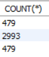  

Create the datetime column that will be used to match the datetime column in the PurpleAir data table

```
ALTER TABLE staging_airnow_sensor_data
ADD COLUMN datetime_timestamp DATETIME;
```
```
UPDATE staging_airnow_sensor_data
SET datetime_timestamp = STR_TO_DATE(REPLACE(utc, 'T', ' '), '%Y-%m-%d %H:%i');
```

## Final tables and insertion

_final_table_creation.sql_

```
DROP TABLE IF EXISTS purpleair_sensors;
CREATE TABLE purpleair_sensors (
	sensor_index INT PRIMARY KEY,
    datetime_date_created DATETIME NOT NULL,
    datetime_last_seen DATETIME NOT NULL,
    `name` VARCHAR(255),
    latitude DECIMAL(9, 6) NOT NULL,
    longitude DECIMAL(9, 6) NOT NULL,
    CHECK (latitude BETWEEN -90 AND 90),
    CHECK (longitude BETWEEN -180 AND 180)
);

INSERT INTO purpleair_sensors (
    sensor_index, datetime_date_created, datetime_last_seen, `name`, latitude, longitude
)
SELECT sensor_index, datetime_date_created, datetime_last_seen, `name`, latitude, longitude
FROM staging_purpleair_sensors;

DROP TABLE IF EXISTS purpleair_sensor_data;
CREATE TABLE purpleair_sensor_data (
	sensor_index INT NOT NULL,
    datetime_timestamp DATETIME NOT NULL,
    humidity DECIMAL(5, 2) NOT NULL,
    temperature DECIMAL(5, 2) NOT NULL, 
    `pm2.5_atm_a` DECIMAL(7, 2) NOT NULL,
	`pm2.5_atm_b` DECIMAL(7, 2) NOT NULL,
    `pm2.5_cf_1_a` DECIMAL(7, 2) NOT NULL,
    `pm2.5_cf_1_b` DECIMAL(7, 2) NOT NULL,
    PRIMARY KEY (sensor_index, datetime_timestamp),
    FOREIGN KEY (sensor_index) REFERENCES purpleair_sensors(sensor_index) ON DELETE CASCADE,
    CHECK (`pm2.5_atm_a` >= 0),
    CHECK (`pm2.5_atm_b` >= 0),
    CHECK (`pm2.5_cf_1_a` >= 0),
    CHECK (`pm2.5_cf_1_b` >= 0)
);

INSERT INTO purpleair_sensor_data (
	sensor_index, datetime_timestamp, humidity, temperature, `pm2.5_atm_a`, `pm2.5_atm_b`,
    `pm2.5_cf_1_a`, `pm2.5_cf_1_b`
)
SELECT sensor_index, datetime_timestamp, humidity, temperature, `pm2.5_atm_a`, `pm2.5_atm_b`,
`pm2.5_cf_1_a`, `pm2.5_cf_1_b`
FROM staging_purpleair_sensor_data;

DROP TABLE IF EXISTS airnow_sites;
CREATE TABLE airnow_sites (
	site_id BIGINT AUTO_INCREMENT,
    latitude  DECIMAL(9,6) NOT NULL,
	longitude DECIMAL(9,6) NOT NULL,
	fullaqscode BIGINT NOT NULL,
    site_name VARCHAR(255) NOT NULL DEFAULT 'N/A',
    PRIMARY KEY (site_id),
    UNIQUE (latitude, longitude)
);

INSERT INTO airnow_sites (latitude, longitude, fullaqscode, site_name)
SELECT
  ROUND(CAST(d.latitude  AS DECIMAL(8,6)), 6)  AS latitude,
  ROUND(CAST(d.longitude AS DECIMAL(9,6)), 6) AS longitude,
  MIN(d.fullaqscode) AS fullaqscode,
  MIN(d.sitename)    AS site_name
FROM staging_airnow_sensor_data d
GROUP BY
  ROUND(CAST(d.latitude  AS DECIMAL(8,6)), 6),
  ROUND(CAST(d.longitude AS DECIMAL(9,6)), 6);

DROP TABLE IF EXISTS airnow_sensor_data;
CREATE TABLE airnow_sensor_data (
	site_id BIGINT NOT NULL,
	datetime_timestamp DATETIME NOT NULL,
	fullaqscode BIGINT NOT NULL,
    pm25_nowcast_value DECIMAL(6, 2) NOT NULL,
    pm25_raw_concentration DECIMAL(6, 2) NOT NULL,
    PRIMARY KEY (site_id, datetime_timestamp),
    FOREIGN KEY (site_id) REFERENCES airnow_sites(site_id) ON UPDATE CASCADE ON DELETE CASCADE
);

INSERT INTO airnow_sensor_data (
site_id, datetime_timestamp, pm25_nowcast_value, pm25_raw_concentration, fullaqscode)
SELECT DISTINCT s.site_id, d.utc, CAST(d.`value` AS DECIMAL(6,2)),
CAST(d.rawconcentration AS DECIMAL(6,2)), d.fullaqscode
FROM staging_airnow_sensor_data d
JOIN airnow_sites s
ON s.latitude  = ROUND(CAST(d.latitude AS DECIMAL(9,6)), 6)
AND s.longitude = ROUND(CAST(d.longitude AS DECIMAL(9,6)), 6);
```

## Analysis

_analysis.sql_

Breaking PM2.5 values into the AQI quality bins, we see that all column categories in both datasets show that vast majority of their observations are in the "Good" AQI bin for all category (all 97%+)

```
CALL pm25_averages('pm25_atm_a', 'purpleair_sensor_data');
CALL pm25_averages('pm25_atm_b', 'purpleair_sensor_data');
CALL pm25_averages('pm25_cf_1_a', 'purpleair_sensor_data');
CALL pm25_averages('pm25_cf_1_b', 'purpleair_sensor_data');
CALL pm25_averages('pm25_nowcast_value', 'airnow_sensor_data');
CALL pm25_averages('pm25_raw_concentration', 'airnow_sensor_data');
```

The first function calls returns...

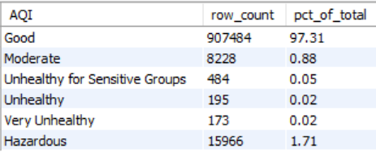 

There was a near perfect correlation for a->a and b->b conversions which is expected as a formula conversion, but both a/b comparisons have extremely small (~-0.0157) coefficients

```
CALL get_correlation('pm25_atm_a', 'pm25_atm_b', 'purpleair_sensor_data', '');
CALL get_correlation('pm25_atm_a', 'pm25_atm_b', 'purpleair_sensor_data', '');
CALL get_correlation('pm25_atm_a', 'pm25_cf_1_a', 'purpleair_sensor_data', '');
CALL get_correlation('pm25_atm_a', 'pm25_cf_1_b', 'purpleair_sensor_data', '');
CALL get_correlation('pm25_atm_b', 'pm25_cf_1_a', 'purpleair_sensor_data', '');
CALL get_correlation('pm25_atm_b', 'pm25_cf_1_b', 'purpleair_sensor_data', '');
CALL get_correlation('pm25_cf_1_a', 'pm25_cf_1_b', 'purpleair_sensor_data', '');
```

To remove the extreme outlier data, the PurpleAir dataset was limited to the max value that appears in AirNow in the 2025 timespan 

32K rows have atleast one PM2.5 value that appear above that, and vast majority of those rows are even above 300 ug/m3 and having averages in the thousands in all columns

```
CREATE OR REPLACE VIEW minimal_purpleair AS
SELECT * FROM purpleair_sensor_data WHERE pm25_atm_a <= 202.1 AND pm25_atm_b <= 202.1 AND
pm25_cf_1_a <= 202.1 AND pm25_cf_1_b <= 202.1;
```

All PurpleAir and AirNow rows that match in timestamp and are under 5 miles from each other will be kept

```
CREATE TABLE sensor_distances AS
SELECT sensor_index, site_id, dist_miles, dist_rank
FROM (
  SELECT p.sensor_index, a.site_id, ROUND(haversine_miles(p.latitude, p.longitude, a.latitude, 
  a.longitude), 2) AS dist_miles, ROW_NUMBER() OVER (PARTITION BY p.sensor_index ORDER BY 
  haversine_miles(p.latitude, p.longitude, a.latitude, a.longitude)) AS dist_rank
  FROM purpleair_sensors p
  CROSS JOIN airnow_sites a
) ranked
WHERE dist_miles <= 5.00;
```
```
CREATE TABLE data_matched AS
SELECT p.sensor_index, d.site_id, d.dist_miles, p.datetime_timestamp, p.humidity, p.temperature,
p.pm25_atm_a, p.pm25_atm_b, p.pm25_cf_1_a, p.pm25_cf_1_b, a.pm25_nowcast_value, a.pm25_raw_concentration
FROM purpleair_sensor_data p
JOIN sensor_distances d
ON p.sensor_index = d.sensor_index
JOIN airnow_sensor_data a
ON a.site_id = d.site_id AND a.datetime_timestamp = p.datetime_timestamp;
```
```
CREATE TABLE minimal_data_matched AS
SELECT *
FROM data_matched
WHERE pm25_atm_a <= 202.1 AND pm25_atm_b <= 202.1 AND pm25_cf_1_a <= 202.1 AND pm25_cf_1_b <= 202.1;
```

When limiting to sensor data within small distances of each other, we still have a lot of sample data to work with

```
SELECT
  SUM(dist_miles <= 0.1) AS `Matched rows <= 0.1`,
  SUM(dist_miles <= 0.5) AS `Matched rows <= 0.5`,
  SUM(dist_miles <= 1.0) AS `Matched rows <= 1.0`,
  SUM(dist_miles <= 5.0) AS `Matched rows <= 5.0`
FROM minimal_data_matched;
```

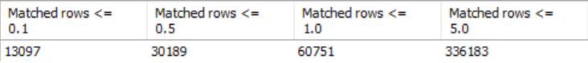 

Essentially no correlation when allowing data above the 202.1 mark (heavy skewing by the 3.44% of rows that follow above it)

All correlation coefficients hover around 0

```
CALL get_correlation('pm25_atm_a', 'pm25_nowcast_value', 'data_matched', '');
CALL get_correlation('pm25_atm_b', 'pm25_nowcast_value', 'data_matched', '');
CALL get_correlation('pm25_cf_1_a', 'pm25_nowcast_value', 'data_matched', '');
CALL get_correlation('pm25_cf_1_b', 'pm25_nowcast_value', 'data_matched', '');
```

Strong correlation for all data under 202.1 PM2.5 (~0.75-0.79) and having sensors within 0.1 miles of each other

```
CALL get_correlation('pm25_atm_a', 'pm25_nowcast_value', 'minimal_data_matched', 'dist_miles <= 0.1');
CALL get_correlation('pm25_atm_b', 'pm25_nowcast_value', 'minimal_data_matched', 'dist_miles <= 0.1');
CALL get_correlation('pm25_cf_1_a', 'pm25_nowcast_value', 'minimal_data_matched', 'dist_miles <= 0.1');
CALL get_correlation('pm25_cf_1_b', 'pm25_nowcast_value', 'minimal_data_matched', 'dist_miles <= 0.1');
```

ATM and CF1 values are nearly identical at low thresholds (under 0.5 miles between sensors), with CF1 making huge jumps in comparative readings above 25 ug/m^3

The ATM column is the one generally recommended to look at for indoor sensors (proprietary formula), so henceforth this is the one that will be looked at

```
SELECT CASE
    WHEN pm25_nowcast_value <= 5 THEN '0–5'
    WHEN pm25_nowcast_value <= 10 THEN '5–10'
    WHEN pm25_nowcast_value <= 25 THEN '10–25'
    WHEN pm25_nowcast_value <= 50 THEN '25–50'
    WHEN pm25_nowcast_value <= 100 THEN '50–100'
    ELSE '100+'
  END AS `range`,
  AVG(pm25_cf_1_a - pm25_atm_a) AS avg_cf1_a_minus_atm_a, AVG(pm25_atm_a) AS avg_atm_a,
  AVG(pm25_cf_1_a) AS avg_cf1_a, AVG(pm25_cf_1_b - pm25_atm_b) AS avg_cf1_b_minus_atm_b,
  AVG(pm25_atm_b) AS avg_atm_b, AVG(pm25_nowcast_value) AS avg_airnow
FROM minimal_data_matched
WHERE dist_miles < 0.5
GROUP BY `range`
ORDER BY MIN(pm25_nowcast_value);
```

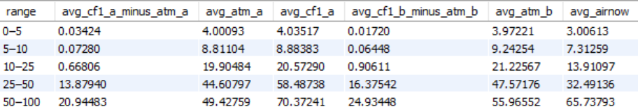

We see larger error readings as PM2.5 ranges increase

```
CALL get_mae('pm25_atm_a', 'pm25_nowcast_value', 'minimal_data_matched', 'dist_miles <= 0.1');
CALL get_mae('pm25_atm_a', 'pm25_nowcast_value', 'minimal_data_matched', 'dist_miles <= 0.5');
CALL get_mae('pm25_atm_a', 'pm25_nowcast_value', 'minimal_data_matched', 'dist_miles <= 1.0');
CALL get_mae('pm25_atm_b', 'pm25_nowcast_value', 'minimal_data_matched', 'dist_miles <= 0.1');
CALL get_mae('pm25_atm_b', 'pm25_nowcast_value', 'minimal_data_matched', 'dist_miles <= 0.5');
CALL get_mae('pm25_atm_b', 'pm25_nowcast_value', 'minimal_data_matched', 'dist_miles < 1.0');
```

The first function calls returns...

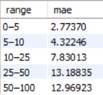

Greater error between sensors as readings increase

```
CALL get_mae('pm25_atm_a', 'pm25_atm_b', 'minimal_data_matched', 'dist_miles < 0.1');
CALL get_mae('pm25_atm_a', 'pm25_atm_b', 'minimal_data_matched', 'dist_miles < 0.5');
CALL get_mae('pm25_atm_a', 'pm25_atm_b', 'minimal_data_matched', 'dist_miles < 1.0');
```

The first function calls returns...

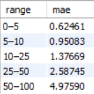

In small to moderate distance concentrations, PurpleAir overestimates PM2.5 values, and underestimates them at larger ones

```
CALL get_bias('pm25_atm_a', 'pm25_nowcast_value', 'minimal_data_matched', 'dist_miles <= 0.1');
CALL get_bias('pm25_atm_a', 'pm25_nowcast_value', 'minimal_data_matched', 'dist_miles <= 0.5');
CALL get_bias('pm25_atm_a', 'pm25_nowcast_value', 'minimal_data_matched', 'dist_miles <= 1.0');
CALL get_bias('pm25_atm_b', 'pm25_nowcast_value', 'minimal_data_matched', 'dist_miles <= 0.1');
CALL get_bias('pm25_atm_b', 'pm25_nowcast_value', 'minimal_data_matched', 'dist_miles <= 0.5');
CALL get_bias('pm25_atm_b', 'pm25_nowcast_value', 'minimal_data_matched', 'dist_miles <= 1.0');
```

The first function calls returns...

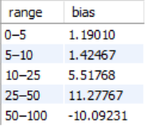

Channel A has slight tendency to overestimate at lower concentrations, and begins to underestimate as concentrations rise

```
CALL get_bias('pm25_atm_a', 'pm25_atm_b', 'minimal_data_matched', 'dist_miles <= 0.1');
CALL get_bias('pm25_atm_a', 'pm25_atm_b', 'minimal_data_matched', 'dist_miles <= 0.5');
CALL get_bias('pm25_atm_a', 'pm25_atm_b', 'minimal_data_matched', 'dist_miles <= 1.0');
```

The first function calls returns...

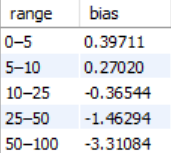

Slightly stronger correlation between humidity and ATM B vs humidity and AirNow (0.13 vs 0.20)

Both ATM columns oddly show an increase in humidity correlation when using closer sensor distances... Possibly due to higher quality locations AirNow sensors are located at

```
CALL get_correlation('humidity', 'pm25_nowcast_value', 'minimal_data_matched', '');
CALL get_correlation('humidity', 'pm25_atm_a', 'minimal_data_matched', '');
CALL get_correlation('humidity', 'pm25_atm_b', 'minimal_data_matched', '');

CALL get_correlation('humidity', 'pm25_nowcast_value', 'minimal_data_matched', 'dist_miles <= 0.1');
CALL get_correlation('humidity', 'pm25_atm_a', 'minimal_data_matched', 'dist_miles <= 0.1');
CALL get_correlation('humidity', 'pm25_atm_b', 'minimal_data_matched', 'dist_miles <= 0.1');
```

While we must rely on PurpleAir for these readings, there is a slightly stronger correlation for humidity to both reading error (A=0.26,B=0.20) and absolute error (A=0.24,B=0.19) compared to humidity and AirNow readings (0.14)

Suggesting humidity might introduce a slight bias in the PurpleAir dataset to overestimate the PM2.5 readings as opposed to what it would otherwise read at lower humidities 

```
CALL get_correlation('humidity', 'pm25_nowcast_value', 'minimal_data_matched', 'dist_miles <= 0.1');
CALL get_correlation('humidity', 'pm25_atm_a', 'minimal_data_matched', 'dist_miles <= 0.1');
CALL get_correlation('humidity', 'atm_a_error', 'minimal_data_matched_error', 'dist_miles <= 0.1');
CALL get_correlation('humidity', 'atm_a_abs_error', 'minimal_data_matched_abs_error', 'dist_miles <= 0.1');
CALL get_correlation('humidity', 'pm25_atm_a', 'minimal_data_matched', 'dist_miles <= 0.1');
CALL get_correlation('humidity', 'atm_b_error', 'minimal_data_matched_error', 'dist_miles <= 0.1');
CALL get_correlation('humidity', 'atm_b_abs_error', 'minimal_data_matched_abs_error', 'dist_miles <= 0.1');
```

Channel disagreement is a strong predictor of error for channel A (0.53), but only a moderate predictor for channel B (0.25)

```
CREATE OR REPLACE VIEW minimal_data_matched_channel_diff AS
SELECT *, ABS(pm25_atm_a - pm25_atm_b) AS ab_diff, ABS(pm25_atm_a - pm25_nowcast_value) AS atm_a_abs_error,
ABS(pm25_atm_b - pm25_nowcast_value) AS atm_b_abs_error
FROM minimal_data_matched;


CALL get_correlation('ab_diff', 'atm_a_abs_error', 'minimal_data_matched_channel_diff', 'dist_miles <= 0.1');
CALL get_correlation('ab_diff', 'atm_b_abs_error', 'minimal_data_matched_channel_diff', 'dist_miles <= 0.1');
```

### Synopsis

After cleaning the PurpleAir dataset by removing unused sensors, sensors with persistently missing humidity/temperature readings, and faulty sensors with entirely missing B-channel PM2.5 values, the final analysis showed several consistent patterns in PurpleAir sensor reliability relative to EPA AirNow monitors.

Initial validation revealed 122 PurpleAir sensors that existed in the metadata table but contributed no historical readings and could therefore be removed entirely. Further inspection of missing-value patterns showed that many sensors with missing humidity and temperature values were consistently missing those measurements across large portions of their observations rather than only sporadically. Approximately 50,390 rows containing missing humidity or temperature values were removed under the assumption that these devices were likely faulty or unreliable environmental reporters. Additional checks also identified two sensors whose ATM B and CF1 B measurements were entirely absent across all contributed rows, leading to their complete removal from the dataset.

Restricting comparisons to sensors within 0.1 miles and limiting PurpleAir observations to values below the AirNow-observed maximum (~202.1 µg/m³) produced strong correlations of roughly 0.75–0.79 across all PurpleAir PM2.5 columns. Including the extreme outlier observations (3.44% of the cleaned dataset) caused correlations to collapse toward zero, demonstrating how heavily a relatively small subset of anomalous PurpleAir readings can distort comparative analysis.

Across increasing PM2.5 concentration ranges, PurpleAir error consistently increased. Mean absolute error rose substantially as concentration levels increased, both between PurpleAir and AirNow and internally between PurpleAir’s A and B channels. Bias analysis further showed that PurpleAir sensors tend to overestimate PM2.5 concentrations at lower-to-moderate ranges before transitioning toward underestimation at higher concentrations relative to AirNow.

The ATM and CF1 correction schemes behaved similarly at lower concentrations and small geographic distances, but CF1 readings diverged sharply at higher concentration ranges, often producing substantially larger PM2.5 values than ATM. Although, the ATM is considered PurpleAir's go-to "outdoor" formula for corrections.

Humidity showed only weak direct correlation with AirNow PM2.5 measurements, but somewhat stronger relationships with PurpleAir readings and PurpleAir error metrics. Correlations between humidity and PurpleAir error/absolute error (~0.19–0.26) were modestly stronger than the humidity-to-AirNow relationship (~0.14), suggesting that elevated humidity may contribute a slight positive bias to PurpleAir measurements. However, the overall relationships remained relatively weak, indicating humidity is likely only one contributing factor among several affecting sensor performance.

One of the strongest findings was the relationship between internal PurpleAir channel disagreement and comparative error against AirNow. The absolute disagreement between ATM A and ATM B showed a strong positive correlation (~0.53) with ATM A absolute error relative to AirNow, while the same relationship for ATM B was more moderate (~0.25). This suggests that internal disagreement between PurpleAir’s dual channels can act as a practical reliability indicator: when the channels closely agree, the sensor is more likely to align with AirNow, while larger disagreement between channels is associated with reduced measurement reliability.

The analysis suggests that PurpleAir sensors can provide reasonably reliable PM2.5 measurements when comparisons are geographically constrained and extreme outlier observations are removed, with correlations against EPA AirNow monitors reaching roughly 0.75–0.79 for sensors within 0.1 miles of each other. However, sensor performance was shown to vary meaningfully with concentration level, environmental conditions, and internal channel consistency. Error and channel disagreement both increased as PM2.5 concentrations rose, while bias patterns showed a tendency for PurpleAir to overestimate lower-to-moderate concentrations before underestimating at higher ranges. Humidity also appeared to introduce a modest positive bias into PurpleAir readings relative to AirNow. One of the strongest findings was that internal disagreement between ATM A and ATM B acted as a meaningful reliability signal, with ATM A error showing a much stronger relationship to channel disagreement than ATM B. This suggests that when the two PurpleAir channels begin to diverge substantially, ATM A is more likely to exhibit larger comparative error relative to AirNow. Overall, the findings support the conclusion that low-cost PurpleAir sensors can align well with regulatory-grade monitors under controlled conditions, but that careful cleaning, spatial filtering, and reliability checks are essential for producing defensible comparisons.